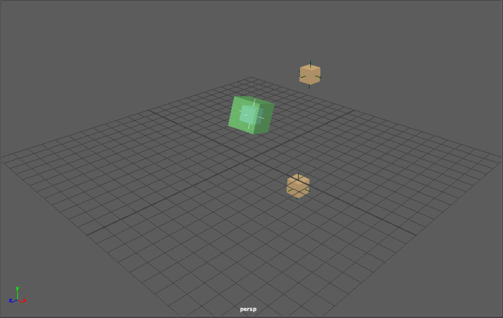
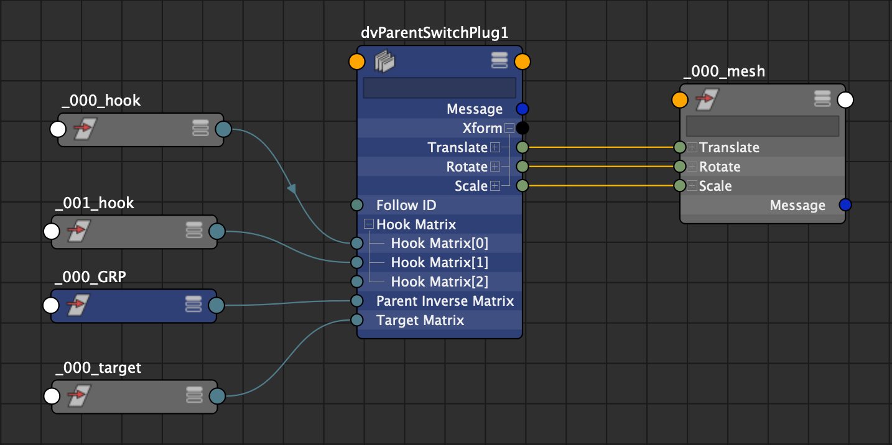

| Plug-ins | maya |
|:--------:|:--------:|
|Mode rig|True|

# dvParentSwitch


## Presentation
The goal of this node is to compute position between a series of target position and hooks.
There is 2 modes rig and anim.
In rig mode you can move hook or target, the plugin store the series of offset matrix and hooks matrix, the output is snap on the target matrix.
In anim mode the plugin read the offset matrix specified by the followID and apply on the hook matrix.


## Attributs

```bash
inputs: {
    rigMode
    followID
    targetMatrix
    hookMatrix : [
            matrixN, 
            matrixN+1, 
            ...
        ]
    parentInverseMatrix
}

storage: {
    offsetMatrix : [
            matrixN, 
            matrixN+1, 
            ...
        ]
}

outputs: {
    xform
        |-translate
        |    |-translateX  
        |    |-translateY  
        |    |-translateZ  
        |-rotate
        |    |-rotateX  
        |    |-rotateY  
        |    |-rotateZ  
        |-scale
        |    |-scaleX  
        |    |-scaleY  
        |    |-scaleZ

}
```
## Node editor Connection


## Commands (python)
